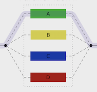

# Motivation

 Going back in time, when Alan Turing built 
[Turing machine](https://en.wikipedia.org/wiki/Turing_machine) to perform computation, Alanzo Chruch designed 
[Lambda Calculus](https://en.wikipedia.org/wiki/Lambda_calculus) to mathematically compute anything by composing lambda functions. 
Soon world got filled with programming languages in both the paradigms and many languages start borrowing each other's concept (sounds familiar?) to only become bloated and un-manageable. 

Fast forward 1977...John Bakus's paper, ["Can programming be liberated from von nuemann style?"](https://github.com/van001/lesscode/blob/master/can-programming-be-liberated.pdf) put it very rightly.

The above article influenced me to dive deep into programming paradigm concepts, specially functional programming and really understand it from the work of those 2 greats.
So begin the journey of [Functional Thinking](https://github.com/van001/lesscode), with few very simple goals in mind - 

- Seek deep understanding of motivation and concepts behind the functional programming, 
without being caught in the programming lanugage nuances, syntax or even nomenclature. 

- Come up with a language agnostic list of real-world functions (library), which can be implemented in any multi-paradigm language that supports functional programming. 

# Overview

This repo is about my learning of functional programming and coming up with a language agnostic library of functions, which
can be applied to solve many real-world problems.

In functional programming languages :

- you either write pure functions (no [side-effects](https://en.wikipedia.org/wiki/Side_effect_(computer_science))) or functions with side-effects. 

- you compose functions to produce a desired outcome.

- you treat functions as a 1st class citizen and pass / return a function to / from another function.


[lesscode-fp](https://github.com/van001/lesscode-fp/blob/master/lesscode/src/index.js), is a language agnostic javascript functional library, which define functions to manipulate  String, List & Map / Object categories.
You can implement these functions in any multi-paradigm language that supports functional programming.
It's built using the following functional programming principles :

### Pure functions ### 
Pure functions have no side-effects, are time independent & maintain [referential transparency](https://en.wikipedia.org/wiki/Referential_transparency), which means, for a given input, you can replace the function with it's return value, anytime. 
Think of them as a mathematical function, which for a given input will awlays return the same output.
This also means, a pure function can easily cache ([memoize](https://en.wikipedia.org/wiki/Memoization)) the value it returns after the execution. This is huge, now that memory / storage is cheap and computation is expensive.

All the functions in lesscode library are pure, unless they are not. Pure function name starts with lowercase,  
impure with uppercase letters.

```
// appends String to another String and returns a new String
const sappend = str1 => str2 => str1 + str2 

// checks if a value is null or not?
const eqNull = val => (val == null || undefined) ? true : false 

// Find the max of 2 munmers
const max = a => b => Math.max(a,b)
```

### Immutable ###
In functional programming you do not mutate data, instead you compute a new. Also, most FP languages support lazy evaluation,
 which means your function is executed only when it's needed. Isn't it sweet...

```
// appends String to another String and returns a new String
const sappend = str1 => str2 => str1 + str2 
```

### Single input / output ### 
The origin of functional programming, ***[lambda calculus](https://en.wikipedia.org/wiki/Lambda_calculus)***, only allowed single input/ ouput. While it may not seem practical, currying ([see below](https://github.com/van001/lesscode-fp#Currying))  allows you to do so. Functional programming treats functions as a 1st class citizen, so you can pass a function as a parameter and return a function as a result.

All lesscode functions accept single parameter and multi-paramter functions are curried.

```
// reverses a List
const lreverse => lfold(([])(lappend)

// sappend takes a String as 1st parameter and using currying , 
// returns a function that takes another String as a parameter
// sappend = str1 => ( (str2) => str1 + str2 )
const sappend = str1 => str2 => str1 + str2 
```

### Currying ### 
[Currying](https://en.wikipedia.org/wiki/Currying) (f(a, b) => f(a)(b)) is applied to all the functions that takes more than one parameter. 
Currying allows you to partially apply other options (initializion) and dependencies (injection) on multi-parameter functions.
Currying also allows you to create your own DSL (domain specific language) by partially applying many generic functions and creating a new domain specfic one.

```
// s2List is a curried function. 
const s2List = ptrn => async str => str.split(ptrn)

// partially apply s2List, with whitespace pattern
const whitspace2List = s2List(space)

// will break String into List on every whitespace.
whitspace2List('This is cool') 
```

### Data-Last ###
Functions that take more than one parameter,  should accept data as the last parameter. If you are coming from imperative programming paradigm, this might be new to you.
In imperative programming you pass data 1st & options (default values - ring the bell?) later.  Or in the case of object oriented programming (still imperative), 
you manipulate the encapsulated data with function(s), which take additional options. 

In FP, data and functions are separate, hence you build library of functions to work with your data.  

Data last principle also allows you to [compose](https://github.com/van001/lesscode-fp#Composition) functions to produce more functions.

```
// l2String converts, List to String. 
// it takes List (which it will convert to String) as a last parameter.
const l2String = sep => lst => lst.join(sep)
```

### Composition ### 
Crux of any programming paradigm is composition. Composition, allows you to re-use the code (less code ;))

In functional programming there is no assignment you just compose functions to produce more specific functions/ solutions. Traditional FP languages like Haskell
has infix composition operator like '.' (for pure function) and '>>= / >>' (for [monadic composition](https://github.com/van001/lesscode-fp#Monad)). Other multi-paradigm languages like javascript, java etc do not have any such 
operators nor they support infix styling.

Lesscode library provide  **$(...)** (for pure functions) & **$M(...)** for [monadic](https://github.com/van001/lesscode-fp#Monad) composition. 

***'$' has a very small foot-print and can be easily spotted to show the composition.***

```
// coconut machine will take List of coconuts, then slice the top & put a straw.
// Using point free styling, you can create such function as -
const cocunutMachine = $(DropStraw ,SliceFromTop)
```

### Fewer Categories ### 
Unlike, Object Oriented programming, where every class is a new category, functional programming benefits from fewer category and coming up with domain specific abstractions to solve them generically.

Lesscode library provide funtions to manipulate / transform the following categories : String, List, Map / Object (non mutable). These categories are quiet popular in many programming languages. List allows for a work distribution, while 
Map / Object allows faster retrieval.

```
// slices String at the specified position
const sslice  = start => end => str => str.slice(start,end)

// converts String to List, by breaking it with supplied pattern
const s2List = ptrn => str => str.split(ptrn)
```

### Functor ###
Until now, we talked about the fundementals of functional programming using simple data-types. 
Real-world is filled with more complex data-types, many of which are some sort of collection
- List, Object, Tuple etc. 

The next few principles have been borrowed from [Category Theory](https://en.wikipedia.org/wiki/Category_theory), 
which provide laws / abstractions on how you treat / manipulate collection of data.
I will try to simplify category theory jargon in terms or real-world practical examples.

Ultimately programming is all about breaking a large / complex problem into list of smaller / simpler problems, executing them concurrently / parallelly / sequentially and essembling the final result. 

Functor allows for you to run bunch of operations concurrently / parallelly. Using a List functor, you 
can map a 'slice' function to slice all the apples (List of apples - californian, fuji...deosn't matter).

Less code library provide an 'lmap' function for the List functor.

```
// Map over List to tranform into another List, while preserving the structure (Functor - borrowed from category theory). 
const lmap = func => lst => lst.map(func)

// convert the List of strings to uppercase
const str = ['neelesh' , 'vaikhary']
const strUpper = lmap(supper)(str)
```

### Monad ### 
Real-world functions have side-effects. Monad, lets you write functions that can separate concerns (decorator pattern), allow side effect (IO), introduce sequence. 

Lesscode implements monad using promise/ async. It also provide a monadic version of all the pure fucntions, so that you can seamlessly use them in [monadic composition](https://github.com/van001/lesscode-fp#Composition). 

```
// Read content of a file. 
const FileRead = option =>  name => fs.promises.readFile(name, option);

// Wait for all Monads to complete.
const Wait = all => Promise.all(all)
```


# Examples

## Algorithms
Coming soon...

## Real-world 

### Parallel ###

 Doing bunch of things in parallel, waiting for the result and then doing something else. 
Also tolerating the failures instead of aborting on any error (if a file download fails it is ok, just write the error).

**[Image Download](https://github.com/van001/lesscode-fp/tree/master/lesscode/examples/image-download)**

Download list of images specified in a file and write metadata(url, size, hash) to the specified output file.


input.txt
```
http://i.imgur.com/c2z0yhtx.jpg
http://i.imgur.com/KxyEGOn.jpg
http://i.imgur.com/vPae8qL.jpg
http://i.imgur.com/cz0yhtx.jpg
```

output.txt
```
http://i.imgur.com/c2z0yhtx.jpg 0  Error%3A%20Request%20failed%20with%20status%20code%20404
http://i.imgur.com/KxyEGOn.jpg 470489 cc042826ed386d4247aca63cb7aff54b37acb1f89ce8f4549ac96a9e8683360c
http://i.imgur.com/vPae8qL.jpg 69085 bde0a62bb35dffe66cebf6cfd9ca3841ca1419fb323281bd67c86145f2173207
http://i.imgur.com/cz0yhtx.jpg 2464218 ed9f8c1e95d58e02fcf576f64ec064a64bc628852bc3b298cda15f3e47dfe251
```

```
// Lesscode-fp
const { 
    $, $M, Hint, Trace, print, hash, Lmap, Wait, mget, exit, mgettwo, 
    linebreak, utf8, newline,  
    L2String, S2List, 
    FileRead, FileWrite,
    HttpGET } = require('lesscode-fp')


const inputFile = process.argv[2]
const outputFile = process.argv[3]

// processFile :: String -> String
const processURL = name => {
    const computeHash = $(hash('sha256'), mget('data'))
    const contentLen = mgettwo('headers')('content-length')
    const LogData = name => async data => `${name} ${contentLen(data)} ${computeHash(data)}`
    const LogErorr = name =>  async err => `${name} 0  ${escape(err)}`
    return $M(
        Trace(`Extracted metadata...............`), LogData(name),      // Success
        Hint(`Downloaded ${name}................`), HttpGET)(name)
        .catch($(Trace(`[Fail] : ${name}........`), LogErorr(name)))    // Failure
}

// Pipeline
$M(
    Trace('Write to output file................'), FileWrite(utf8)(outputFile), 
    Trace('Convert List 2 String...............'), L2String(newline), 
    Trace('Wait................................'), Wait, 
    Trace('Processed URLs......................'), Lmap(processURL), 
    Trace('Converted to List...................'), S2List(linebreak), 
    Trace('Read input file.....................'), FileRead(utf8))(inputFile)
.catch($(exit, print))

```
### Streaming ###

Sometimes, input is a **stream** or needs to be handled in chunk.

**[File Streaming](https://github.com/van001/lesscode-fp/tree/master/lesscode/examples/file-streaming)**

Streams content of a text file, converts to uppercase then write back to another stream (output file).


input.txt (the real file may be huge...)
```
this text is all lowercase. please turn it into to uppercase.
```

output.txt
```
THIS TEXT IS ALL LOWERCASE. PLEASE TURN IT INTO TO UPPERCASE.
```

```
const { $M, print, utf8, FileStreamIn, FileStreamOut} = require('lesscode-fp')

const Uppercase = async str => str.toUpperCase()
const SaveFile = name => FileStreamOut(utf8)(name)

// Process Stream
const ProcessStream = $M(SaveFile(process.argv[3]),Uppercase)

// Pipeline
FileStreamIn(utf8)( ProcessStream )(process.argv[2]).catch(print)
```


