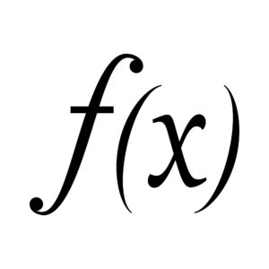

# Motivation

Going back in time, when Alan Turing built 
the [Turing machine](https://en.wikipedia.org/wiki/Turing_machine) to perform computation, Alanzo Chruch designed 
[Lambda Calculus](https://en.wikipedia.org/wiki/Lambda_calculus) to mathematically compute anything by composing lambda functions (world's smallest programming language). 
The soon world flooded with programming languages in both paradigms and many languages start borrowing each other's concepts (sounds familiar?) only to become bloated and unmanageable. 

Fast forward, 1977, John Bakus's paper, ["Can programming be liberated from Von Neumann style?"](https://github.com/van001/lesscode/blob/master/can-programming-be-liberated.pdf) put it very rightly.

The above article influenced me to dive deep into programming paradigm concepts, mostly functional programming, and understand it from the work of those two greats.
So begin the journey of [Functional Thinking](https://github.com/van001/lesscode), with few straightforward goals in mind :

- Seek a deep understanding of the functional programming's motivation and concepts, without being caught in the programming languages nuances/jargon, syntax, or even nomenclature. 

- Come up with a language-agnostic list of real-world functions (library), and implement it in a multi-paradigm language that supports functional programming. 

# Overview

This repo is about my learning of functional programming and coming up with a language-agnostic library of functions, which
can be applied to solve many real-world problems. I will also compare it to object-oriented (imperative) programming, where the difference is significant.

In functional programming :

- Data is immutable. You compute a new value using pure/impure functions.

- Functions are pure (no [side-effects](https://en.wikipedia.org/wiki/Side_effect_(computer_science))) but you are allowed to write impure functions.

- Solutions are composed using functions.

----
[lesscode-fp](https://github.com/van001/lesscode-fp/blob/master/lesscode/src/index.js), is a language agnostic javascript functional library, which define and implement functions to compose both pure and impure functions along with the functions to manipulate & transform String, List & Map / Object categories.
You can implement these functions in any multi-paradigm language that supports functional programming. 
```
// to install and play with javascript library
yarn add lesscode-fp

//or
npm install lesscode-fp
```
It is still an experimental library, so use at your discretion.

# Functional Programming
Functional programming is all about generalization, so even the learnings are divided into fewer categories :
- [Fundemetals](https://github.com/van001/lesscode-fp#fundementals) : talks about core concepts require in declaring and composing pure functions.
- [Categories](https://github.com/van001/lesscode-fp#categories) : talks about generic data-types and why fewer is better.
- [Morphism](https://github.com/van001/lesscode-fp#morphism) : talks about data transformations.
- [Side-effects](https://github.com/van001/lesscode-fp#side-effects) : talks about declaring and composing real-world functions, which are not pure.

---
***Object-oriented programming thrives in broader categorization of complexities (using multiple classes), functional programming thrives in generalization of complexities into few categories.***

---

# Fundementals

### Pure functions ### 


Pure functions have no side-effects, are time-independent & maintain [referential transparency](https://en.wikipedia.org/wiki/Referential_transparency), which means, for a given input, you can replace the function with its output, anytime. 
Think of them as a mathematical function, which will always return the same output for a given input.
It also means a pure function can easily cache ([memoize](https://en.wikipedia.org/wiki/Memoization)) the value it returns after the execution. 

Lesscode library functions are pure unless they are not. Pure functions are named starting with lowercase; uppercase for impure.

```
// appends String to another String and returns a new String
const sappend = str1 => str2 => str1 + str2 

// checks if a value is null or not?
const eqNull = val => (val == null || undefined) ? true : false 

// Find the max of 2 munmers
const max = a => b => Math.max(a,b)
```

### Immutable ###

In functional programming, you do not mutate data; instead, you compute a new. 
Now that memory/storage is cheap, this is one of the major advantages of functional programming.

Lesscode adheres to the principle unless it's a Monad ([see below](https://github.com/van001/lesscode-fp#monad-endofunctor))

```
// appends String to another String and returns a new String
const sappend = str1 => str2 => str1 + str2 
```

### Single input / output ### 


The origin of functional programming, ***[lambda calculus](https://en.wikipedia.org/wiki/Lambda_calculus)***, only allowed single input/ output. While it may not seem practical, currying ([see below](https://github.com/van001/lesscode-fp#Currying)) allows you to do so. Functional programming treats functions as a 1st class citizen, so you can pass and return a function to/from another function.

Also, single input/output makes function composition (see below) trivial.

Lesscode functions accept a single parameter (whereever possible); multi-parameter functions are curried.

```
// reverses a List, point-free (see [Data-Last](https://github.com/van001/lesscode-fp#Data-Last)).
// same as : lreverse =>  lst => lfold(([])(lappend)(lst)
const lreverse => lfold(([])(lappend)

// sappend takes a String as 1st parameter and using currying , 
// returns a function that takes another String as a parameter
// sappend = str1 => ( (str2) => str1 + str2 )
const sappend = str1 => str2 => str1 + str2 
```

### Currying ### 

[Currying](https://en.wikipedia.org/wiki/Currying) (f(a, b) => f(a)(b)), allows function with multiple parameters to be written as sequence of functions that each take a single parameter. 

Currying allows you to partially apply other options (initialization) and dependencies (injection) on multi-parameter functions.

Currying also allows you to create domain-specific language (DSL) by partially applying many generic functions.

So, if you are writing a multi-parameter function, please curry it.

Every function in lesscode library is curried and [point-free](https://en.wikipedia.org/wiki/Tacit_programming) (where possible).

```
// it splits a String into List based on pattern matching.
// s2List is a curried function. 
const s2List = ptrn => str => str.split(ptrn)

// suppose your domain breaks Sting into List based on space.
// partially apply s2List, with space, and create a new function.
const space2List = s2List(space)

// will break String into List on every whitespace.
space2List('This is cool') // ['This','is','cool']
```

### Data-Last ###
Functions that take more than one parameter should accept data as the last parameter. If you are coming from an imperative programming paradigm, this might be new to you.
In imperative programming, you pass data 1st & options (default values - ring the bell?) later. Or in the case of object-oriented programming (still imperative), 
you manipulate the encapsulated data with function(s), which take additional options. 

In FP, data and functions are separate; hence you build a library of functions to work with your data. 

Data last principle makes function [composition](https://github.com/van001/lesscode-fp#Composition), easier (builder pattern). Also, it allows for a point-free style of writing functions.

All the functions in lesscode library accept data as the last parameter.

```
// takes List as the last parameter 
const l2String = sep => lst => lst.join(sep)

// coverts List of Strings to uppercase; point free
twoUpper = lmap(suppercase)
```

### Composition ### 
The crux of any programming paradigm is composition. Composition allows you to re-use the code (less code ;-))

In functional programming there is no assignment, you just compose functions to produce more specific functions/ solutions. 

Functional programming language like Haskell has infix composition operator like '.' (for pure function) and '>>= / >>' (for [monadic composition](https://github.com/van001/lesscode-fp#monad-endofunctor)). Other multi-paradigm languages like javascript, java, etc do not have any such operators nor they support infix styling.

Lesscode library provides :
- **$(...)** for pure function composition.
- **$M(...)** for [monadic](https://github.com/van001/lesscode-fp#monad-endofunctor) composition. 
- **$E(...)** for [applicative](https://github.com/van001/lesscode-fp#Applicative) composition.
- **$3(...)** for [stream](https://github.com/van001/lesscode-fp#Stream) composition.

```
/** 
Coconut machine will take List of coconuts, then slice the top & put a straw.
coconutMachine = DropStraw . SliceFromTop
**/
const coconutMachine = $(DropStraw ,SliceFromTop)

// to copy the content of one file to another (point-free)
const FileCopy = to => $M(FileWrite(utf8)(to), FileRead(utf8))
```
***'$' has a tiny footprint and can be easily spotted to show the composition.***

# Categories 

While primitive data-types like numbers, characters, bytes are great for mathematical functions, real-world functions require complex 
data-types like strings / lists / maps of something. 

### Fewer Categories ### 
Unlike Object Oriented programming, where every class is a new category, functional programming has fewer categories. 
Each category then has its domain-specific abstractions, functions & algebra.

Lesscode library provides functions to manipulate/transform the following categories: String, List, Map / Object (non-mutable). 
These categories are quite popular in many programming languages.
List allows easier work distribution; Map / Object allows faster retrieval; String is a preferred way of storing data. 

Lesscode library prefixes the 1st letter of the category (s, l, m) for all the category-specific functions. 
This design is by choice. It allows you to spot which category a function belongs easily.

```
// slices String at the specified position
const sslice = start => end => str => str.slice(start,end)

// converts String to List, by breaking it with supplied pattern
const s2List = ptrn => str => str.split(ptrn)
```
# Morphism

### Functor ###
Since functional programming is already about abstraction ( what to do, not, how to do), the proliferation of [Category Theory](https://en.wikipedia.org/wiki/Category_theory) took it to the next level.

In category theory, the Functor is a structure-preserving transformation from one category to another. Since Functor always produces another functor, the composition is trivial.

E.g., transforming List of lowercase text to List of uppercase, transforming List of Strings to List of Hash of Strings.

Lesscode library implements  **'lmap'** for List functor.  
Using lmap, you can transform one List into another. **lmap** essentially lifts each item from the List, apply the function, then puts back the result into the new List.

```
// Map over List to tranform into another List, 
// while preserving the structure (Functor - borrowed from category theory). 
const lmap = func => lst => lst.map(func)

// convert the List of Strings to uppercase
const str = ['neelesh' , 'vaikhary']
const strUpper = lmap(supper)(str)
print(strUpper) // ['NEELESH' , 'VAIKHARY']

// Applying the cocununt machine logic to slice & straw, list of coconuts
const readyCoconut = lmap($(DropStraw ,SliceFromTop))
// ['strawed sliced coconut', 'strawed sliced coconut']
print(readyCoconut['full coconut', 'full coconut']) 
```

### Catamorphism ###
While Functor allows structure-preserving morphism, catamorphism allows non-structure preserving morphism, like transforming List into a Map,
or a List into a Tree. The other thing about this transformation is that each category may apply different algebra, so 1+1 can be 2 in one
category, but it can be 11 in another.

Lesscode library provides **lfold** for List catamorphism.

- lfold - folds left to right
- lfoldr - folds right to left

```
// ['1','2','3','4'] => 1234
list2String = lfold([])(sum)
```
Lesscode provides many built-in catamorphisms :

```
- s2String // '12' => [1,2]
- l2String, // [1,2,3] => '12'
- l2countMap (histogram), // [1,1,3] => { '1' : , '3' : 0}
- l2indexMap, // [1,1,3] => { '1' : [0,1]. '3' : 2}
- m2List // { '1' : [0,1]. '3' : 2} => [[0,1][1,1][2,3]]
- m2valList, // { '1' : [0,1]. '3' : 2} => [[0,1],[2]]
- m2keyList // { '1' : [0,1]. '3' : 2} => [1,3]
```
# Side-effects 

### Monad (endofunctor) ### 
Until now, we only talked about pure functions, but real-world functions have side-effects (hidden data, wrapped context), are in-predictable (fail or different result), need sequential execution (one after another), or just too complicated.

Monads, let you do all that. Monads let you write functions that can separate concerns (decorator pattern), allow side effects (IO), introduce sequence, hide complexity.

Think of Monad as a function that wraps all the side effects and makes it a pure and allow composition by passing the value from one to another. In category
theory jargon, Monads are just a [Monoid](https://en.wikipedia.org/wiki/Monoid_(category_theory)) (Category with a single element that can join). 

*** Monad is just a monoid in the category of endofunctors - Saunders Mac Lane***

Lesscode provides some built-in Monads using javascript async (promise). 

**$M(...)** supports [monadic composition](https://github.com/van001/lesscode-fp#Composition) (instead of a >==> operator or kliesli arrow , as it's called in category theory). 

$ indicates composition, M denotes Monad, or sequence.

```
// Read the content of a file. 
const FileRead = option => name => fs.promises.readFile(name, option);

// mondaic composition : copy the content of one file to another (point-free)
const FileCopy = to => $M(FileWrite(utf8)(to), FileRead(utf8))
```

### Applicative ###
While monadic composition executes functions (with side-effects) sequentially, applicatives run them concurrently. 

Lesscode implements applicative composition using **$E(...)** and accept Primitive / Object / List as a parameter. 
If the parameter is a List, all the functions are concurrently applied to all the items to produce another List.

$ indicates composition, and E denotes concurrency.

```
// apply max, min concurrently to the list of two numbers
$E(sum(3), sum(2))([1,2,4]).then(Print) // [ 3, 4, 6, 4, 5, 7 ]

// make 2 Http call concurrently and return the result as a List
$E(HttpGET())(['https://www.google.com','https://www.yahoo.com']).then(Print)
```

### Stream ###
While monads and applicatives allow for a sequential and concurrent data flow, another abstraction would apply something after another forever.
Like, picking water from one bucket, doing something with it, and dumping to another, forever. 
I am not sure if there is a name for this in functional programming, but I'd like to call it a Stream. 

Lesscode implements stream as **$3**. $ means it's still a composition, but 3 denotes that its arity is 3, i.e., it accepts 3 parameters (out-stream, function, instream)

[Stream example](https://github.com/van001/lesscode-fp#Stream)

# Examples

## Algorithms
Even though FP language libraries provide an implementation of many of the high-level abstractions like sort, 
linked List, etc., they do not offer all.

Algorithms span many domains, and hence it becomes tricky to provide a single generic library. 

Lesscode library provides generic functions to solve many such coding problems. 

### List 
[2sum](https://github.com/van001/lesscode-fp/tree/master/lesscode/examples/algorithms/2sum.js)

Given an array of integers nums and an integer target, return indices of the two numbers add up to the target.
You may assume that each input would have exactly one solution, and you may not use the same element twice.
You can return the answer in any order.

examples
```
nums = [2,7,11,15], target = 9 => [0,1]
nums = [3,3], target = 6 => [0,1]
```

Solution
```
/**
 * Logic is very self-explanatory :
 * 1. Transform List to another List by subracting it from the target : lmap(sub)
 * 2. Join the 2 List to obtain matching indices : ljoinIndex
 * 3. Remove dupes - [[1,2], [2,1]] => [[1,2]] : lcollapse
 * 4. Discard self - [[0,0]] => []

**/

const {
 $M, 
 sub, 
 eqNot,
 comma, s2List, 
 lcollapse, llift2, lmap, lflat, lfilter, ljoinIndex, 
 Print,
} = require('lesscode-fp')

const target = process.argv[3]
const nums = s2List(comma)(process.argv[2].slice(1,-1))

// [3,3] / 6 => [[1,1]]
const twoSum = nums => target => {

 // Remove self : [ [ 0, 0 ], [ 1, 2 ], [ 2, 1 ] ] => [ [ 1, 2 ], [ 2, 1 ] ]
 const ldropSelf = lfilter(llift2(eqNot))

 // Transform List to sublist with subtraction
 const subList = lmap(sub(target))(nums)

 return $(ldropSelf, lcollapse, ljoinIndex(subList))(nums) 
}
```
The above solution will work for more than one too. 

This is the beauty of functional programming. Once you build a domain-specific library, it is all about simple composing.

[3Sum](https://github.com/van001/lesscode-fp/tree/master/lesscode/examples/algorithms/3sum.js)

Instead of 2 numbers, if we ask for the sum of 3 numbers to be equal to the target, the above code can be easily extended to find the 3sum.

```
/**
 * Logic is very self-explanatory:
 * 1. Making every item in the List as target find 2sum that satisfy the criteria for 3sum
**/

const threeSum = nums => target =>{
    //  [[ 3, 3, 5 ]] => []
    const ldropSelf = lfilter(llift3( a => b => c => a != b  && a != c && b != c))
    const all2Sum = lfoldA()(cat => index => val => $(lappend(cat),lmap(lappend([index])),twoSum(nums))(val))
    return $(Print, ldropSelf, lcollapse, all2Sum,lmap(sub(target)))(nums)
} 
```

## Real-world 

Many of the real-world problems involve :
- processing data sequentially / concurrently.
- processing synchronously / asynchronously. 
- processing bulk / continuous stream of data.

### Sequential
Doing things one after another, like reading the file, converting it to uppercase, and writing back to another file.

input.txt 
```
writing less-code is cool...
```

output.txt 
```
writing less-code is cool...
```

```
const {
 suppercase,
 $M, // Composition
 FileRead, FileWrite, // IO Monad
} = require('lesscode-fp')

const In = process.argv[2]
const Out = process.argv[3]
$M(FileWrite(utf8)(Out), suppercase, FileRead(utf8))(In)
```

### Concurrent 

Doing things concurrently, also tolerating failures instead of aborting on error (if a file download fails, it is ok, write the error).

**[Image Download](https://github.com/van001/lesscode-fp/tree/master/lesscode/examples/image-download)**

Download the List of images specified in a file and write metadata(URL, size, hash) to the specified output file.

input.txt
```
http://i.imgur.com/c2z0yhtx.jpg
http://i.imgur.com/KxyEGOn.jpg
http://i.imgur.com/vPae8qL.jpg
http://i.imgur.com/cz0yhtx.jpg
```

output.txt
```
http://i.imgur.com/c2z0yhtx.jpg 0 Error%3A%20Request%20failed%20with%20status%20code%20404
http://i.imgur.com/KxyEGOn.jpg 470489 cc042826ed386d4247aca63cb7aff54b37acb1f89ce8f4549ac96a9e8683360c
http://i.imgur.com/vPae8qL.jpg 69085 bde0a62bb35dffe66cebf6cfd9ca3841ca1419fb323281bd67c86145f2173207
http://i.imgur.com/cz0yhtx.jpg 2464218 ed9f8c1e95d58e02fcf576f64ec064a64bc628852bc3b298cda15f3e47dfe251
```

```
// Lesscode-fp
const {
 linebreak, utf8, newline, // Strings
 hash, // math
 l2String, s2List, // List
 mget, mgettwo, // Map
 $M, $E, // Composition
 Print, // Monad 
 FileRead, FileWrite, // IO Monad
 HttpGET // IO Monad
} = require('lesscode-fp')

const LogData = name => async data => `${name} ${mgettwo('headers')('content-length')} ${hash('sha256')(mget('data'))}`
const LogErorr = name => async err => `${name} 0 ${escape(err)}`

// processURL :: String -> String
const ProcessURL = name => $M(LogData(name), HttpGET())(name).catch(LogErorr(name))

const In = process.argv[2]
const Out = process.argv[3]
// Main pipeline. Classic mix of sequence ($M - monad) & concurrency ( $E - applicative)
$M(FileWrite(utf8)(Out),l2String(newline), $E(ProcessURL), s2List(linebreak), FileRead(utf8))(In).catch(Print)
```
### Stream ###

Sometimes, the input is a continuous **stream** of data, which needs to be processed forever.

**[File Streaming](https://github.com/van001/lesscode-fp/tree/master/lesscode/examples/file-streaming)**

Stream content of a text file, convert to uppercase, then write back to another stream (output file).

input.txt (the real file may be enormous)
```
this text is all lowercase. please turn it into to uppercase.
```

output.txt
```
THIS TEXT IS ALL LOWERCASE. PLEASE TURN IT INTO TO UPPERCASE.
```

```
const { 
 utf8, 
 suppercase,
 $3, 
 FileStreamIn, FileStreamOut
} = require('lesscode-fp')

const is = FileStreamIn(utf8)(process.argv[2])
const os = FileStreamOut(utf8)(process.argv[3])

/**
Streaming pipeline. 
A classic example of doing pure function composition inside two im-pure (Monads),
which also happens to be the stream.
Stream also allows monadic composition, since it converts pure to moand, internally.
**/
$3(os)(suppercase)(is)
```


